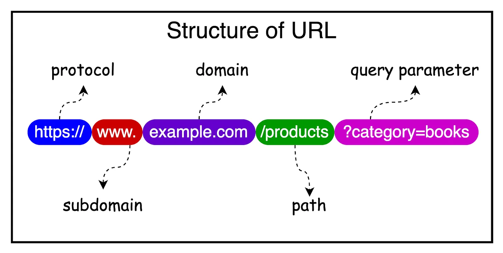

# A Crash Course on REST APIs

APIs are the backbone of software communication.

In the acronym API, the word "Application" refers to software that performs a
distinct function. An "Interface" is a contract between two applications that
defines a set of rules, protocols, and methods for communication. "Programming"
makes all of this possible.

APIs have been around for a long time in one form or the other:

* In the 60s and 70s, we had subroutines and libraries to share code and
  functionality between programs.
* In the 1980s, Remote Procedure Calls (RPC) emerged, allowing programs running
  on different computers to execute procedures on each other.
* With the widespread adoption of the Internet in the 2000s, web services such
  as SOAP became widely adopted.
* The late 2000s and early 2010s marked the rise of RESTful APIs, which have
  since become the dominant approach due to their simplicity and scalability.

In recent years, the API-first approach to software development has gained
significant traction, driven by the emphasis on building loosely coupled
services. REST APIs, in particular, have emerged as the go-to choice for
developers worldwide.

## Introduction to REST APIs...

REST stands for Representational State Transfer. Roy Fielding coined the term in
his doctoral dissertation in 2000. He defined REST as an architectural style for
designing networked applications.

Some important principles form the basis of REST architecture.

### Key Terminologies

Several terminologies are associated with REST and it's important to know about
them to build a complete picture.

#### HTTP (HyperText Transfer Protocol)

HTTP is the foundation protocol for communication on the web and defines a set
of rules or conventions for transmitting data between a client (such as a web
browser) and a server.

It's a stateless protocol, meaning each request is independent, and the server
doesn't keep any information about the previous requests.

HTTP follows a request-response model. The client sends a request to the server
and the server sends back a response.

* Each HTTP request consists of a method (such as GET, POST, PUT, DELETE),
  headers, and an optional body (containing data).
* HTTP responses include a status code, headers, and an optional body
* (containing the response data or an error message).

#### URLs

URLs are the addresses used to reach resources on the web.

They provide a standard way to specify the location of a resource, such as a web
page, an image, or an API endpoint. We will look into resources more closely a
couple of sections later.

A typical URL consists of several components, including the protocol (HTTP or
HTTPS), the domain name, the path to the resource (such as `/api/users`), and
optional query parameters.

The diagram below shows the structure of a URL.



#### Client-Server Architecture

The client-server architecture is a fundamental concept in web development.

In this architecture, the client sends requests to the server. The server
processes the requests and sends back responses. The client takes care of
presenting hte user interface, while the server handles the business logic, data
processing, and storage.

The client and server communicate over a network (such as the Internet),
typically using the HTTP protocol. REST APIs leverage the principles of HTTP,
URLs, and client-server architecture to expose resources and functionality to
the clients.

#### Resource-Based Architecture in REST

In REST, the core concept is the resource.

A resource is any piece of information that can be named and accessed through a
URL. It can be a user, a product, an order, or even a collection of other
resources. Typically, resources are represented using standard formats, such as
JSON or XML.

A REST API is designed around the manipulation of these resources.

As we already discussed, each resource is identified by a unique URL, known as
the resource URL or endpoint. The REST API exposes a set of standard HTTP
methods that clients can use to interact with the resources. In other words, a
resource can be retrieved, created, updated, or deleted by sending the
appropriate HTTP requests to the corresponding URLs.

It's important to follow good naming conventions for the resources. The
conventions can help create a consistent and intuitive REST API that is easy for
developers to understand and work with.

Here are some guidelines that can be considered while designing the resource
endpoints:

* **Use nouns, not verbs**: Resource URLs should represent the entities or
  concepts in your system, not the actions performed on them. For example, use
  `/users` instead of `/getUsers` or `/createUser`.
* **Use plural nouns for collections**: For a collection of resources, use
  plural nouns. For example, `/products` represent a collection of product
  resources.
* **Use hierarchical paths**: The URL structure should reflect resources with a
  hierarchical or nested relationship. For example, `/orders/12/items` represent
  the collection of items within a specific order.
* **Use hyphens to separate words**: If a resource name consists of multiple words,
  use hyphens to separate them. For example, `/product-categories` or
  `/user-profiles`
* **Use lowercase letters**: Resource names should be lowercase to maintain
  consistency and avoid confusion

### HTTP Methods with REST APIs

HTTP methods are used in REST APIs to perform different operations on resources.
The most commonly used HTTP methods are `GET`, `POST`, `PUT`, `PATCH`, and
`DELETE`.

Together, these HTTP methods form the foundation of CRUD operations in REST
APIs.

The `GET` method retrieves or reads a resource from the server.

It is a safe and idempotent operation, meaning that multiple identical requests
should have the same effect as a single request and should not modify the
resource.

When a GET request is sent to a resource URL, the server responds with the
representation of the requested resource.

For example, `GET /users` retrieves a list of users, while `GET /users/456`
retrieves a specific user with ID `456`.

```bash
curl -X GET www.example.com
```

The `POST` method is used to create a new resource on the server.

We can use it to submit data to the server, typically resulting in the creation
of a new resource. The data is sent in the request body using JSON or XML format
and the server responds with the created resource or a status indicating the
success of the operation.

For example, `POST /users` creates a new user based on the data provided in the
request body.

```
# URL 
curl -d "key1=value1&key2=value2" \
    -H "Content-Type: application/x-www-form-urlencoded" \
    -X POST http://localhost:8000/data
```

```
# JSON-formatted
curl  -d '{"key1":"value1", "key2":"value2"}' \
    -H "Content-Type: application/json" \
    -X POST http://localhost:8000/data
```

The `PUT` method updates or replaces an existing resource on the server.

It's an idempotent operation, just like `GET`. This means that multiple
identical requests should have the same effect as a single request.

The client sends the complete representation of the updated resource in the
request body. If the resource does not exist, the server may choose to create a
new resource with the specified URL.

For example, `PUT /users/123` updates the user with ID `123` with the data
provided in the request body.

```
curl -X PUT
-H "Content-Type: application/json" -d '{"name": "hello", "email":"hello@example.com"}'
```

The `PATCH` method partially updates an existing resource on the server.

Unlike `PUT`, which requires sending the complete representation of the
resource, `PATCH` allows sending only the changes to be applied.

The server applies the specified changes to the resource and responds with the
updated resource or a status indicating the success of the operation.

For example, `PATCH /users/123` partially updates the user with ID `123` based
on the changes provided in the request body.

## API Design Best Practices

### API Versioning

#### 1. URL Versioning
#### 2. Query Parameter Versioning
#### 3. Custom Header Versioning

In this approach, a custom header is used to specify the API version.

Example: `X-API-Version: 1` or `X-API_Version: 2`

It has the same advantages as query parameter versioning. However, it requires
additional header configuration in the client code.

### Pagination

Pagination in REST APIs limits the number of results returned in a single API
response, especially when dealing with large datasets.

It allows clients to retrieve data in smaller, more manageable chunks and
improves the performance of the API.

Common pagination parameters include page (the current page number) and limit
(the number of items per page). The API should return pagination metadata in the
response, such as the total number of items, total pages, and links to the next
and previous pages.

For example, `GET /users?page=2&limit=10` retrieves the second page of users
with 10 items per page.

### Filtering

Filtering lets clients narrow down the number of records based on specific
criteria. This helps reduce the amount of data transferred over the network.

We can implement filtering using query parameters, where the client specifies
field and value to filter on.

The API should document the available filtering options and the syntax for
applying filters.

For example, `GET /products?category=electronics&price_max=100` retrieves
products in the electronics category with a price less than or equal to 100.

### Sorting

Sorting lets clients specify the order in which the results should be returned.
Clients can control the sorting criteria to present the data in a meaningful way
for the users.

We can implement sorting using query parameters, where the client specifies the
field to sort on and the sorting order (ascending or descending).

For example, `GET /users?sort=name&order=asc` retrieves users sorted by name in
ascending order.

### Error Handling

Proper error handling is crucial for building a robust and user-friendly API.

The API should return meaningful error messages and appropriate HTTP status
codes to indicate the type of error. Error responses should include a clear
error message, an error code or type, and additional details if necessary.

### Authentication and Authorization in REST API

When it comes to securing REST API, authentication and authorization are two
fundamental security concepts.

#### Authentication

This is the proesss of verifying the identify of the user or client accessing
the API. It answers the question: "Who are you?"

Authentication ensures the the user or client is who they claim to be. Common
authentication mechnisms in REST APIs include:

* Username and password-based authentication
* API keys or tokens (for example, JWTs)
* OAuth for delegated access

Authentication is important for the following reasons:

* Protecting sensitive data and functionality
* Tracking and auditing user actions
* Personalization and customization based on the identity of the user

#### Authorization

Authorization is the process of determining what actions or resources a user or
client is allowed to access once their identity is authenticated.

It answers the question: "What are you allowed to do?"

Common authorization mechanisms in REST APIs include:

* Role-based Access Control (RBAC): Users are assigned roles, and permissions
  are granted based on those roles.
* Attribute-Based Access Control (ABAC): Access is granted based on attributes
  or characteristics of the user, resource, or environment
* OAuth scopes: OAuth tokens include scopes that define the permissions and
  access levels granted to the client

Authorization is importatnt for the following reasons:

* Ensuring that users or clients can only access resources and perform actions
  they are authorized to
* Protecting sensitive data and functionality from unauthorized access or
  modification
* Implementing granular access control based on user roles, permissions, or
* attributes

## Scalability and Performance in Desinging REST API

Having understood the theoretical aspects of REST APIs, it's time to examine
some key practical considerations when designing them for scalability and
performance.

Here are the most important ones.

### Stateless Architecture

As we discussed earlier, HTTP is a stateless protocol. It's also beneficial to
design the REST APIs to be stateless, meaning that each request from the client
should contain all the necessary information for the server to process it.

Practically, this might translate to a few important points, such as:

* Not storing session data on the server side can hinder scalability and make
  distributing requests across multiple servers difficult
* Using stateless authentication mechanisms like JSON Web Tokens or API keys for
  authentication
* Alternatively, when using sessions for authentication, the session information
  is stored in a separate storage rather than on the API server instance

### Caching

### Efficient Data Serialization

### Asynchronous Processing and Message Queues


## [REST API Cheatsheet](https://blog.bytebytego.com/p/ep94-rest-api-cheatsheet)

1. Client-Server: Emphasizes the separation of user interface concerns (Client)
  from data storage and processing concerns (Server) to enhance portability and
  scalability.
2. Stateless: Dictates that each request from a client to a server must contain
  all the necessary information for processing, ensuring no session state is
  stored on the server between requests. (???)
3. Cacheable: Ensures that responses can be explicitly marked as cacheable or
  non-cacheable, allowing clients to reuse previously fetched responses to
  enhance efficiency and reduce load.
4. Layered System: Architecture may have multiple layers, and a client interacts
  without knowing if it communicates with the end server or an intermediary
  layer, promoting scalability and security.
5. Code-on-Demand: Servers can temporarily extend or customize a client's
  functionality by transferring executable code, enhancing flexibility and
  adaptability.
6. Uniform Interface: A consistent and standardized interface simplifies and
  decouples interactions, making systems independent and easier to evolve.


